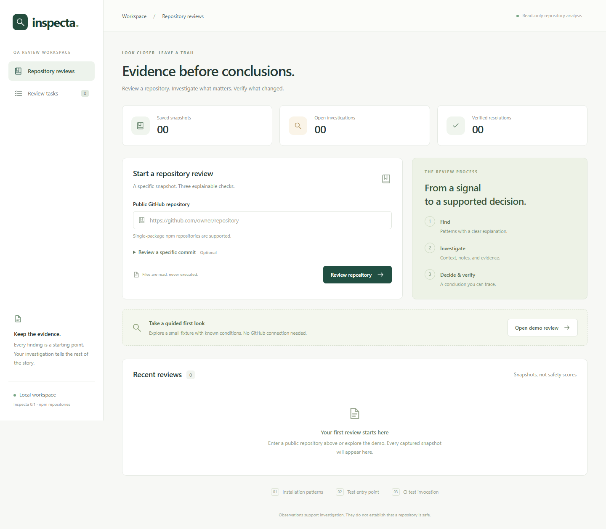

# Inspecta

**Evidence before conclusions.** A local QA workbench for investigating public npm repository snapshots, recording decisions, and verifying fixes.



Repository → findings → review task → investigation → decision → fix verification.

Inspecta reads selected files at a recorded commit. It never installs dependencies or executes code from an inspected repository. A finding is an observation, not a verdict. There is no repository safety score.

## Run it

Requires Node.js **24.15 or newer within the 24.x release line** and npm. SQLite is provided by Node itself.

```sh
npm ci --ignore-scripts
npm run build
npm start
```

Open **http://127.0.0.1:3001**. Click **Open demo review** to explore a deliberately seeded fixture without GitHub access. The fixture and its content-derived identifiers are explicitly labeled synthetic.

For development, run `npm run dev` and open http://127.0.0.1:5173. Vite proxies `/api` to the backend on port 3001.

Data persists in `data/inspecta.sqlite`, excluded from source control. `INSPECTA_DB` overrides this path; `PORT` overrides the backend port. Development's proxy assumes port 3001. The server binds to loopback; public hosting and multi-user operation are outside this release.

For higher GitHub API limits, set `GITHUB_TOKEN` in the backend process environment. It is optional for public repositories. Keep it out of source control and frontend variables. `.env.example` documents the variables; the app does not automatically load .env files.

## What you can do

- Capture a public, single-package npm repository at its default-branch commit or a specified full SHA.
- Read three explainable checks and inspect source lines, exclusions, confidence reasons, and investigation suggestions.
- Group related findings into a review task and save an issue report and notes.
- Record a decision separately from task status.
- Verify a proposed fix with explicit evidence; preserve failed/inconclusive attempts and reopen tasks.

Statuses: **Review → Awaiting Fix → Verification → Closed**.

Decisions: **Undecided, Confirmed issue, Expected behavior, False positive**.

Passed verification requires evidence and confirmation that every criterion was checked. Disappearing findings do not close tasks. Static inspection cannot establish that tests ran or passed; external execution evidence must be supplied and attributed by the reviewer.

## Check boundaries

| Rule       | Supported condition                                                                              | Key limitation                                                                                                          |
| ---------- | ------------------------------------------------------------------------------------------------ | ----------------------------------------------------------------------------------------------------------------------- |
| INSTALL-01 | Single-line literal curl/wget pipeline to sh/bash in preinstall, install, postinstall or prepare | Unquoted HTTP(S) URL, simple flags; no wrappers, compound commands, dependency scripts or general shell interpretation  |
| TEST-01    | Missing/empty scripts.test or exact npm default placeholder                                      | Opaque non-placeholder commands are recorded without validating behavior                                                |
| CI-01      | No recognized direct npm test / npm run test in root GitHub Actions workflow files               | Delegation, arbitrary actions, custom commands, malformed files and incomplete inventories make assessment inconclusive |

The CI recognizer permits ordinary checkout, setup-node, cache and artifact actions as setup context. It recognizes literal npm install/ci/build commands and simple echo/version statements without treating them as test commands. These conventions do not prove the absence of indirectly executed tests.

Vitest dependency/configuration names and conventional .test/.spec filenames are supporting signals only. Configuration is never imported. Missing root manifests and npm workspaces are unsupported; malformed manifests are inconclusive.

Limits: 5,000 inventory entries; 30 relevant file fetches; 256 KiB per file; 2 MiB captured text; 30 seconds per scan; 8 MiB per API response. Symlinks, submodules, binaries and Git LFS content are not followed. Partial and failed scans are visibly distinct.

## Tests and portfolio evidence

```sh
npm test
npm run evaluate
npm run build
npx playwright install chromium
npm run test:e2e
```

Browser tests use an isolated in-memory database on port 3101. Normal automated suites mock GitHub and require no credentials. Test discovery is restricted to `tests/` and `e2e/`; fixture strings are never executed.

- [Requirements, scope and acceptance criteria](INSPECTA_PLAN.md)
- [Test strategy and traceability](docs/TEST_STRATEGY.md)
- [Generated rule evaluation](docs/EVALUATION.md)
- [Example defect reports](docs/DEFECT_REPORTS.md)
- [Review-to-verification walkthrough](docs/DEMO.md)
- [Implementation architecture](docs/ARCHITECTURE.md)
- [Local validation record](docs/VALIDATION.md)

GitHub Actions runs tests, a production build, fixture evaluation, and browser tests. The workflow must be run on your own GitHub repository after publishing; a local pass does not establish a hosted CI run.

## Project structure

```text
src/                 React screens and CSS
server/github.js     Bounded, commit-pinned GitHub retrieval
server/rules.js      Deterministic rules over captured text
server/store.js      SQLite persistence and task transitions
server/app.js        HTTP API and static file hosting
fixtures/            Inert demo data and evaluation labels
tests/               Rule, API, persistence and retrieval tests
e2e/                 Browser workflow tests
docs/                QA portfolio evidence and walkthrough
```

This is a learning portfolio project. The fixture evaluation is small and synthetic, not a claim of comprehensive security analysis or real-world detection accuracy.
